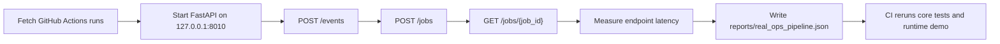
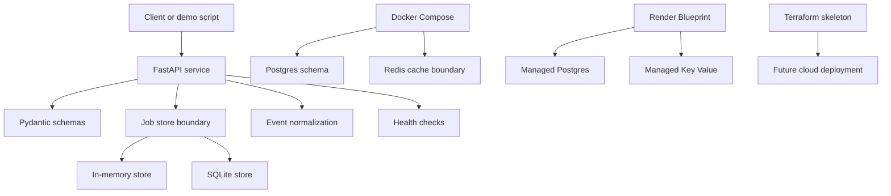

# Cloud Infrastructure Lab

[](https://github.com/nguyenthevietquang07/cloud-infra-lab/actions/workflows/ci.yml)

Backend/platform engineering lab for a small operations API with health checks,
job workflows, local persistence boundaries, real CI/CD metadata ingestion,
latency measurement, Docker Compose, Terraform planning, runbooks, and CI.

## Why This Project Exists

This project demonstrates the operational side of backend engineering: the
parts that make a service understandable, testable, and maintainable after the
happy path works. It is built around reproducible setup, clear API boundaries,
measured behavior, and documentation that another engineer could use.

## What It Demonstrates

- Python API service with FastAPI-compatible entrypoint
- Typed request and response schemas with Pydantic
- Job storage boundary with in-memory and SQLite implementations
- Redis-backed job status cache boundary
- Optional API-key guard for staging deployments
- Request IDs and structured JSON access logs
- Event normalization for public GitHub Actions workflow metadata
- Postgres schema for request and audit records
- Redis-style cache boundary
- Docker Compose for local service, database, and cache
- Render Blueprint for staging deployment with managed Postgres and Key Value
- Terraform skeleton for future cloud deployment planning
- Runtime demo, load-test script, runbook, and GitHub Actions CI

## Tech Stack

| Layer | Tools |
|---|---|
| API | Python, FastAPI, Uvicorn, Pydantic |
| Data | SQLite boundary, Postgres schema, Redis-style cache boundary |
| Infrastructure | Docker, Docker Compose, Render Blueprint, Terraform skeleton |
| Quality | unittest, runtime API demo, observability demo, security audit, dependency audit, load-test script, GitHub Actions |
| Operations | health checks, request IDs, structured JSON logs, runbook, JSON report artifacts |

## Demo Flow



## Architecture



## Measured Evidence

Run the real-data operations pipeline:

```bash
python scripts/real_ops_pipeline.py --owner nguyenthevietquang07 --repo cloud-infra-lab --limit 5
```

Latest measured report: `reports/real_ops_pipeline.json`.

| Measurement | Value |
|---|---:|
| Source | GitHub Actions workflow runs |
| Workflow runs processed | 5 |
| API operations measured | 15 |
| Event ingest mean latency | 8.5275 ms |
| Job create mean latency | 11.3116 ms |
| Job fetch mean latency | 9.6384 ms |
| Event ingest p95 latency | 18.1050 ms |

These measurements validate local API processing of public CI/CD metadata. The
staging evidence below verifies the deployed environment separately.

Latest Render staging verification: `reports/render_staging_smoke.json` and
`reports/render_load_test.json`.

| Staging measurement | Value |
|---|---:|
| Hosted service | `https://cloud-infra-lab-api.onrender.com` |
| Smoke checks passed | 8 / 8 |
| Load-test requests | 50 |
| Load-test concurrency | 5 |
| Load-test success rate | 100% |
| Load-test p95 latency | 586.6600 ms |
| Load-test error rate | 0.0000 |

These staging measurements validate a Render-hosted service, managed Postgres
persistence, managed Key Value status caching, protected API endpoints, and a
bounded request burst. They are not uptime, production-user, or sustained-load
claims.

## Quickstart

Install dependencies:

```bash
python -m pip install -r requirements.txt
```

Run the test suite:

```bash
python -m unittest discover -s tests
```

Run the observability demo:

```bash
python scripts/observability_demo.py
```

Run the security and dependency checks:

```bash
python -m pip install -r requirements-dev.txt
python scripts/security_checklist.py
python scripts/dependency_audit.py
```

Run the local API demo and data pipeline:

```bash
python scripts/runtime_demo.py
python scripts/real_ops_pipeline.py --owner nguyenthevietquang07 --repo cloud-infra-lab --limit 5
```

Run with local infrastructure:

```bash
python scripts/docker_smoke.py
```

`scripts/runtime_demo.py` starts the service on `127.0.0.1:8010`, calls
`/health`, `/events`, and `/jobs`, fetches the created job, and writes
`reports/runtime_api_demo.json`.

`scripts/docker_smoke.py` starts Docker Compose in detached mode, verifies the
API health endpoint, creates a job, confirms Redis-backed status caching,
restarts the API container, fetches the same job back from Postgres and Redis,
writes `reports/docker_smoke.json`, and tears the stack down.

The API returns an `X-Request-ID` response header and emits structured JSON
access logs with request ID, method, path, status code, and duration. The local
proof is saved in `reports/observability_demo.json`.

## Render Staging

`render.yaml` defines a Render Blueprint for a Python web service, managed
Postgres, managed Key Value cache, generated staging `API_KEY`, and `/health`
checks. The staging service is verified at
`https://cloud-infra-lab-api.onrender.com`. Deploy instructions are in
`docs/render_deployment.md`.

After a Render URL exists, verify it with:

```bash
python scripts/staging_smoke.py --base-url https://YOUR-SERVICE.onrender.com --api-key YOUR_API_KEY
python scripts/staging_load_test.py --base-url https://YOUR-SERVICE.onrender.com --api-key YOUR_API_KEY --requests 50 --concurrency 5
```

Saved staging evidence:

- `reports/render_staging_smoke.json`
- `reports/render_load_test.json`

## Documentation

- `docs/runbook.md`: operational runbook and troubleshooting notes
- `docs/real_data_pipeline.md`: source, measurement method, and claim boundary
- `docs/agile_backlog.md`: prioritized backlog and delivery plan
- `docs/security.md`: security baseline, dependency audit, and claim boundary
- `docs/render_deployment.md`: Render Blueprint deployment and staging checks

## Portfolio Positioning

Built a cloud infrastructure lab with a containerized API, Postgres/Redis local
stack, Render Blueprint staging path, health-check endpoints, job/status
workflow, real GitHub Actions operations-data ingestion, latency measurement
reports, optional API-key guarding, request-scoped structured logging, CI
security/dependency checks, Terraform planning, and runbook documentation.

Current scope: reproducible platform lab with local Docker evidence and a
deployed Render staging environment. Production-user, uptime, and sustained-load
claims require monitoring data beyond the saved bounded staging checks.
