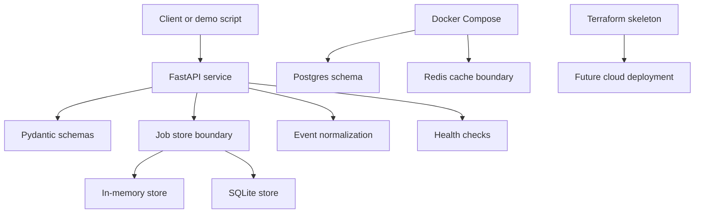

# Cloud Infrastructure Lab

Hands-on backend/platform lab for a small API service with local infrastructure,
health checks, caching, operations notes, CI, and runbook-style QA.

## Why this exists

This project is a resume-safe way to demonstrate infrastructure and operations
skills without claiming production ownership. It focuses on reproducible setup,
testing, observability habits, and deployment thinking.

This is a passion project because I like the unglamorous parts that make real
software usable: health checks, job boundaries, operational reports, CI/CD
signals, and runbooks that make a service explainable under pressure.

## Architecture

- Python API service with FastAPI-compatible entrypoint
- Typed request/response schemas with Pydantic
- Job storage boundary with in-memory and SQLite implementations
- Postgres schema for request/audit records
- Redis-style cache boundary
- Docker Compose for local service, database, and cache
- In-memory job/status workflow for async processing patterns
- Terraform skeleton for cloud planning
- Standard-library tests for business logic
- GitHub Actions CI workflow

## Tech Stack

| Layer | Tools |
|---|---|
| API | Python, FastAPI, Uvicorn, Pydantic |
| Data | SQLite boundary, Postgres schema, Redis-style cache boundary |
| Infrastructure | Docker, Docker Compose, Terraform skeleton |
| Quality | unittest, runtime API demo, load-test script, GitHub Actions |
| Operations | health checks, runbook, structured report artifacts |

## Demo Flow


## Service Boundary



## Real Ops Pipeline

Run the real-data operations pipeline:

```bash
python scripts/real_ops_pipeline.py --owner nguyenthevietquang07 --repo cloud-infra-lab --limit 5
```

Latest measured report: `reports/real_ops_pipeline.json`.

| Measurement | Value |
|---|---:|
| Source | GitHub Actions workflow runs |
| Workflow runs processed | 2 |
| API operations measured | 6 |
| Event ingest mean latency | 14.6652 ms |
| Job create mean latency | 9.8130 ms |
| Job fetch mean latency | 8.4729 ms |
| Event ingest p95 latency | 16.6326 ms |

These measurements validate local API processing of public CI/CD metadata. They
do not claim hosted uptime, production traffic, or client load.

## Quickstart

```bash
python -m unittest discover -s tests
```

With dependencies installed:

```bash
python scripts/runtime_demo.py
python scripts/real_ops_pipeline.py --owner nguyenthevietquang07 --repo cloud-infra-lab --limit 5
docker compose up --build
python scripts/load_test.py --url http://localhost:8000/health --requests 25
```

`scripts/runtime_demo.py` starts the FastAPI service locally on
`127.0.0.1:8010`, calls `/health`, `/events`, `/jobs`, fetches the created job,
and writes `reports/runtime_api_demo.json`.

## Resume-safe claim

Built a cloud infrastructure lab with a containerized API, Postgres/Redis local
stack, health-check endpoints, job/status workflow, real GitHub Actions
operations-data ingestion, latency measurement reports, CI tests, Terraform
planning skeleton, and runbook documentation.

Do not claim this handled real production users unless it is deployed and measured.
